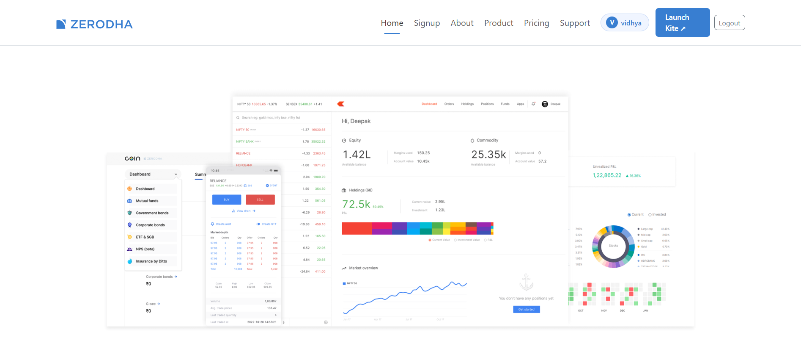
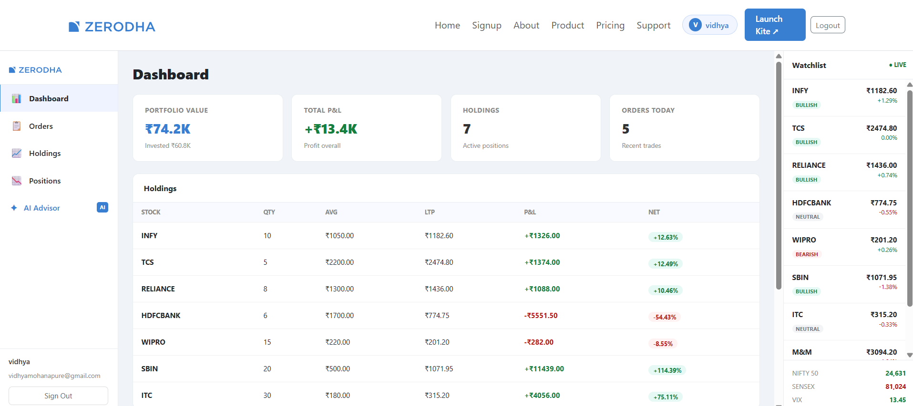
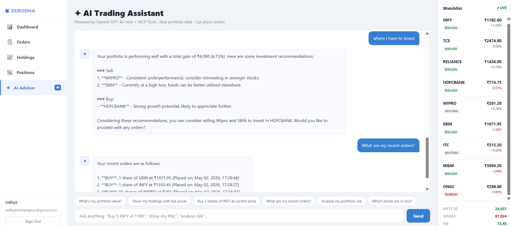
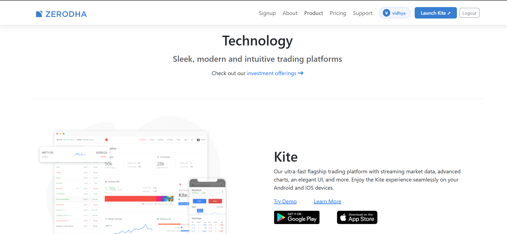

# Zerodha Clone — Full-Stack Trading Platform

A production-grade Zerodha clone with AI-powered trading features, real-time NSE stock prices, and agentic AI workflows.

## 🚀 Live Demo
- **Frontend:** [Vercel](https://zerodha-ldpm.onrender.com)
- **Backend API:** [Render](https://zerodha-ldpm.onrender.com)

## 🛠 Tech Stack

| Layer | Tech |
|---|---|
| Frontend | React 19, React Router v7, Bootstrap 5 |
| Backend | Node.js, Express.js |
| Database | MongoDB Atlas (Mongoose) |
| AI Agents | OpenAI GPT-4o-mini (tool-use / agentic loop) |
| Real-time Data | Yahoo Finance API (NSE live prices) |
| Auth | JWT + bcryptjs |
| MCP | Model Context Protocol server for AI tool access |

## ✨ Features

### Landing Site
- Responsive Zerodha-style marketing pages (Home, About, Products, Pricing, Support)
- AI Market Sentiment widget (live BULLISH/BEARISH/NEUTRAL badges)
- Scroll-reveal animations, sticky navbar

### Trading Dashboard (`/app`)
- **Live NSE prices** — refreshed every 30 seconds via Yahoo Finance
- **Watchlist** with B/S buttons, sentiment badges, live price indicator
- **Holdings** — real portfolio with live P&L calculations
- **Orders** — full history with AI natural language search
- **Positions** — open positions with live prices
- **Buy/Sell Modal** — risk checker (SAFE/CAUTION/BLOCKED), places real orders

### AI Agents (OpenAI GPT-4o-mini)
1. **Portfolio Advisor** — analyses holdings, gives rebalancing recommendations
2. **Order Risk Agent** — checks concentration risk before placing orders
3. **Order Query Agent** — natural language order search ("show my buy orders this week")
4. **Market Sentiment Agent** — BULLISH/BEARISH/NEUTRAL with 30-min cache
5. **AI Trading Chat** — conversational agent with MCP tools (can fetch prices, place orders, analyse portfolio in one chat)

## 🗂 Project Structure

```
zerodha/
├── backend/              # Express API + AI agents
│   ├── agents/           # 4 OpenAI agentic workflows
│   ├── mcp/              # MCP server (tradingMCP.js)
│   ├── middleware/        # JWT auth
│   ├── models/           # Mongoose models
│   └── index.js          # Main server
└── frontend/             # React app
    └── src/
        ├── landing_page/ # Marketing site
        └── trading/      # Trading dashboard
            ├── TradingApp.js
            ├── Sidebar.js
            ├── WatchList.js
            ├── BuyModal.js
            └── pages/    # Dashboard, Orders, Holdings, Positions, AIAdvisor
```

## ⚙️ Local Setup

```bash
# Backend
cd backend
cp .env.example .env   # add MONGO_URL, OPENAI_API_KEY, JWT_SECRET
npm install
npm start              # runs on :3002

# Frontend
cd frontend
echo "REACT_APP_BACKEND_URL=http://localhost:3002" > .env
npm install
npm start              # runs on :3000
```

## 🔑 Environment Variables

**Backend `.env`:**
```
MONGO_URL=mongodb+srv://...
OPENAI_API_KEY=sk-...
JWT_SECRET=your_secret
PORT=3002
```

**Frontend `.env`:**
```
REACT_APP_BACKEND_URL=http://localhost:3002
```

## 📸 Screenshots

### 🏠 Home Page


### 📊 Trading Dashboard


### 🤖 AI Trading Advisor


### 📦 Products & About

